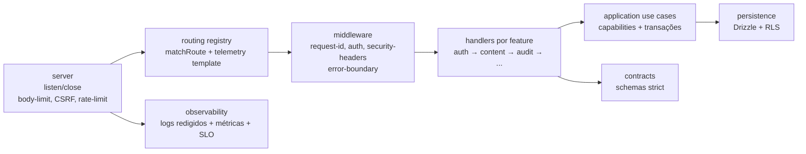

# Component View — apps/api

Estado da modularização (honesto):

- Feito (fase 1): `routing/route-registry.ts` (fonte de classificação + paridade
  testada com `routeTemplate()`), `http/request-context.ts`,
  `security/rate-limit-store.ts`, `security/security-headers.ts`.
- Pendente (backlog): migrar o runtime de `server.ts` para o registry, extrair
  `http.ts` (4267 linhas) em `features/*` com handlers finos. Sem big-bang.
