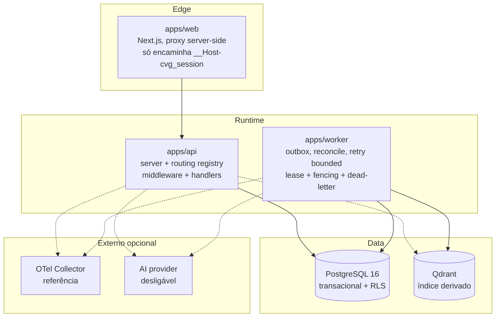

# Container View

- API e worker são processos separados; web nunca acessa dados diretamente.
- Setas tracejadas = opcional/degradável (falha não derruba o núcleo).
- Sem orquestrador prescrito (sem Kubernetes por §83 até necessidade provada).
