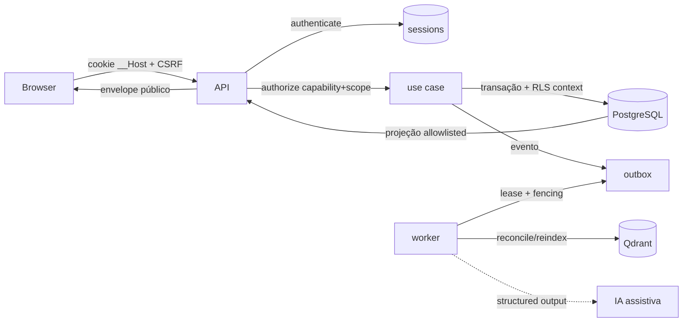

# Data Flow

Invariantes:

- Autorização é server-side e deny-by-default; RLS é defesa adicional, nunca a única.
- Projeções públicas nunca contêm IDs internos, tokens, segredos ou payload clínico além do necessário (schemas + `verify:exposure`).
- Escrita crítica usa CAS/idempotency key; conflito → 409, nunca sobrescrita silenciosa.
- Auditoria é append-only com actor/scope/action/outcome, sem conteúdo sensível.
