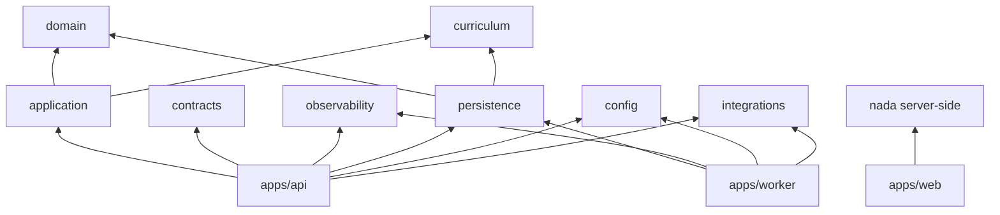

# Dependency Rules

Fonte executável: `architecture-boundaries.json` + `verify:architecture`
(graph de pacotes + imports proibidos por camada). Direções permitidas:

Regras duras:

- `domain`/`curriculum`/`contracts`/`config`/`observability`/`ui` não importam
  runtime alheio (testado por padrão de import).
- `application` nunca importa persistência, integrações, config, contratos,
  observabilidade, Drizzle, Qdrant ou SDK de IA.
- `apps/web` nunca importa camadas server-side, Drizzle ou SDKs.
- Novos ciclos proibidos quebram o build (teste de boundaries, sem exceção
  silenciosa).
