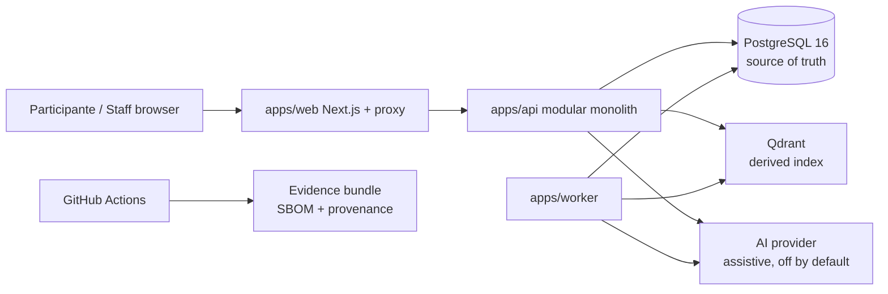

# System Context

- Usuários: participantes (trilha, diagnóstico, tentativas, feedback, apelações),
  staff (moderação, revisão clínica, relatórios), operador CI.
- Sistemas externos reais: nenhum em produção (sem IdP, sem e-mail/SMS, sem
  telemetria externa). Qdrant/IA são dependências internas opcionais.
- Decisão clínica sempre humana; IA e índice nunca decidem estado, nota,
  gabarito, publicação, papel ou autonomia.
